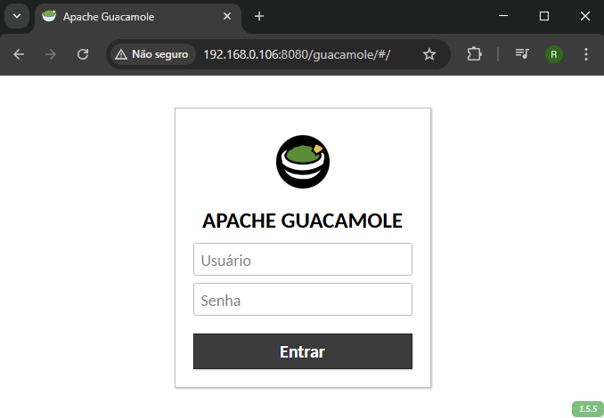

# Apache Guacamole
1. Download docker-compose.yml from this repository.
~~~~
anderson@lab:~$ wget https://raw.githubusercontent.com/andersonluispereira/apache-guacamole/refs/heads/main/docker-compose.yml

anderson@lab:~$ ls
docker-compose.yml
~~~~
2. Execute the command `docker compose up -d`:
~~~~
anderson@lab:~$ docker compose up -d

[+] Running 4/4
 ✔ Network anderson_guac-net  Created                                                                              0.0s
 ✔ Container guac             Started                                                                              0.3s
 ✔ Container guac-sql         Started                                                                              0.3s
 ✔ Container guac-web         Started                                                                              0.5s
~~~~
3. Check if the containers are running `docker ps`:
~~~~
anderson@lab:~$ docker ps

CONTAINER ID   IMAGE                 COMMAND                  CREATED         STATUS                            PORTS                                         NAMES
98113867dd5f   guacamole/guacamole   "/opt/guacamole/bin/…"   2 minutes ago   Up 2 minutes                      0.0.0.0:8080->8080/tcp, [::]:8080->8080/tcp   guac-web
6c989409bbf4   mysql                 "docker-entrypoint.s…"   2 minutes ago   Up 2 minutes                      3306/tcp, 33060/tcp                           guac-sql
c02fc8a9c044   guacamole/guacd       "/bin/sh -c '/opt/gu…"   2 minutes ago   Up 2 minutes (health: starting)   4822/tcp                                      guac
~~~~
4. Generate the script to initialize the Mysql database `docker run --rm guacamole/guacamole /opt/guacamole/bin/initdb.sh --mysql > initdb.sql`:
~~~~
anderson@lab:~$ docker run --rm guacamole/guacamole /opt/guacamole/bin/initdb.sh --mysql > initdb.sql

anderson@lab:~$ ls
docker-compose.yml  initdb.sql
~~~~
5. Copy the `initdb.sql` to the container `guac-sql` with `docker cp initdb.sql guac-sql:initdb.sql`:
~~~~
anderson@lab:~$ docker cp initdb.sql guac-sql:initdb.sql
Successfully copied 25.1kB to guac-sql:initdb.sql
~~~~
6. Execute the bash inside the `guac-sql` container `docker exec -it guac-sql bash`:
~~~~
anderson@lab:~$ docker exec -it guac-sql bash
bash-5.1#

bash-5.1# ls
afs  boot  docker-entrypoint-initdb.d  home        lib    media  opt   root  sbin  sys  usr
bin  dev   etc                         initdb.sql  lib64  mnt    proc  run   srv   tmp  var
~~~~
7. Access Mysql and create the `guacamole_db` database:
~~~~
bash-5.1# mysql -u root -p
Enter password: pass

Welcome to the MySQL monitor.  Commands end with ; or \g.
Your MySQL connection id is 10
Server version: 9.2.0 MySQL Community Server - GPL

Copyright (c) 2000, 2025, Oracle and/or its affiliates.

Oracle is a registered trademark of Oracle Corporation and/or its
affiliates. Other names may be trademarks of their respective
owners.

Type 'help;' or '\h' for help. Type '\c' to clear the current input statement.

mysql>
mysql> CREATE DATABASE guacamole_db;
Query OK, 1 row affected (0.01 sec)

mysql> quit
Bye
bash-5.1#
~~~~
8. Run the initializating SQL scipt into Mysql `cat initdb.sql | mysql -u root -p guacamole_db`:
~~~~
bash-5.1# cat initdb.sql | mysql -u root -p guacamole_db
Enter password: pass
bash-5.1#
~~~~
9. Create the user `guacamole_user`:
~~~~
bash-5.1# mysql -u root -p
Enter password: pass
Welcome to the MySQL monitor.  Commands end with ; or \g.
Your MySQL connection id is 12
Server version: 9.2.0 MySQL Community Server - GPL

Copyright (c) 2000, 2025, Oracle and/or its affiliates.

Oracle is a registered trademark of Oracle Corporation and/or its
affiliates. Other names may be trademarks of their respective
owners.

Type 'help;' or '\h' for help. Type '\c' to clear the current input statement.

mysql>
mysql> CREATE USER 'guacamole_user'@'%' IDENTIFIED BY 'pass';
Query OK, 0 rows affected (0.02 sec)

mysql>
mysql> GRANT SELECT,INSERT,UPDATE,DELETE ON guacamole_db.* TO 'guacamole_user'@'%';
Query OK, 0 rows affected (0.01 sec)

mysql>
mysql> FLUSH PRIVILEGES;
Query OK, 0 rows affected, 1 warning (0.01 sec)

mysql> quit
Bye
bash-5.1# exit
exit
~~~~
10. Remote the containers with `docker compose down`:
~~~~
anderson@lab:~$ docker compose down

[+] Running 4/4
 ✔ Container guac-web         Removed                                                                  0.3s
 ✔ Container guac             Removed                                                                  0.2s
 ✔ Container guac-sql         Removed                                                                  1.3s
 ✔ Network anderson_guac-net  Removed                                                                  0.3s
~~~~
11. Create the containers again `docker compose up -d`:
~~~~
anderson@lab:~$ docker compose up -d

[+] Running 4/4
 ✔ Network anderson_guac-net  Created                                                                  0.0s
 ✔ Container guac-sql         Started                                                                  0.3s
 ✔ Container guac             Started                                                                  0.3s
 ✔ Container guac-web         Started                                                                  0.5s
~~~~
12. Apache Guacamole shoude be acessible throu port `8080`.
~~~~
http://localhost:8080/guacamole/#/
~~~~

13. Default user and password are `guacadmin`.